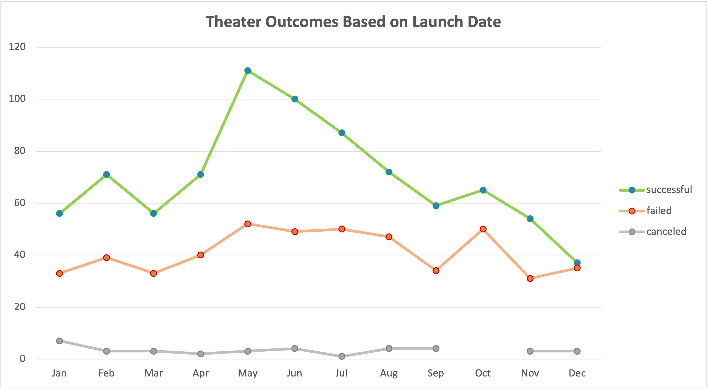
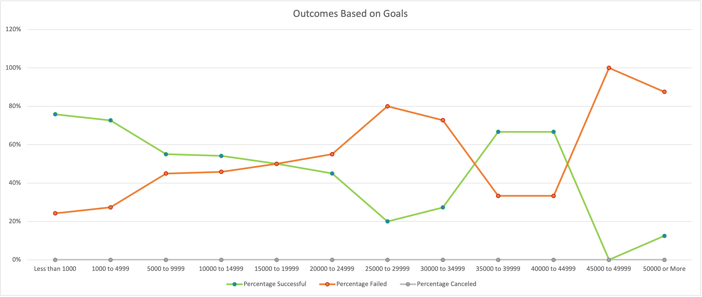

# Kickstarting with Excel

## Overview of Project
This project was initiated by Louise, who is looking to fund her play, Fever. She believes she will need to raise $10,000, and would like to set herself up for success in crowdfunding by first analyzing data on other crowdfunding projects from Kickstarter.
### Purpose
The purpose of this project is to analyze crowdfunding data to identify what factors increase the likelihood of a particular project being successful. In this case, I am looking to determine what makes a crowdfunding project for a play successful. 
## Analysis and Challenges
The full results of the analysis can be found here: [Kickstarter_Challenge.xlsx](Kickstarter_Challenge.xlsx). 
### Analysis of Outcomes Based on Launch Date
To analyze if launch date had any correlation with the success of a crowdfunding project, I first used a formula to convert the Unix timestamps in the "deadline" and "launched_at" columns into readable dates. I then was able to create a pivot table that showed how many successful, failed, and canceled projects happened in each month of the year, filtered by theater projects specifically.

The graph below shows the results of that analysis:

Overall, the number of canceled and failed theater projects were more or less consistent across time. The number of successful projects, however, spiked in the months of May and June, remaining elevated in July and August until returning to normal levels for the fall and dipping in the winter.

### Analysis of Outcomes Based on Goals

I then set out to look at plays (a subcategory of theater projects) specifically, and to see what the relationship was between the original goal for the crowdfunding project, and the success of the project. I used "countif" functions to create a table that tallied how many successful, failed, and canceled projects occured in 12 separate goal ranges (i.e., less than $1,000, between $1,000 and $4,999, etc.). To avoid the formulas becoming too laborious and to reduce errors, I created extra helper columns with the top and bottom of each range, as well as the outcome, to lock the formulas to those cells rather than rewriting the words and numbers in the formulas every time. I then compared the total amount of plays counted in the table against the data set to make sure that everything was counted correctly. 

The graph below shows the results of that analysis:

### Challenges and Difficulties Encountered

The data set from Kickstarter was quite large, so it was a challenge to sort through in various ways to ensure I was only analyzing the data that was most relevant to Louise's project. To this end, I added additional columns, and utilized the "Text to Column" feature, to separate out Parent Category from Subcategory to look closely at data pertaining to plays. The first time I attempted to use "Text to Column", the whole data set did not separate because I had active filters; I noticed that the "subcategory" column was not completed and was able to fix the error by clearing all filters and then applying "Text to Column" again. On several other occasions I had to set or reset the filters, making sure that I was thoroughly erasing any prior filters and viewing all the data (and nothing but the data) that I wanted to see. 

## Results

- What are two conclusions you can draw about the Outcomes based on Launch Date?

- What can you conclude about the Outcomes based on Goals?

- What are some limitations of this dataset?

- What are some other possible tables and/or graphs that we could create?
